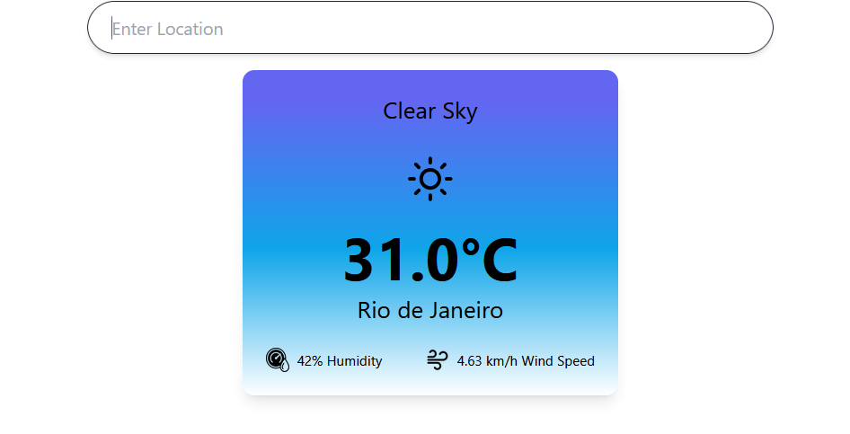

# WeatherApp




> Aplicativo web que consulta as condições climáticas de qualquer cidade do mundo. Informe uma localização e obtenha dados  sobre temperatura, umidade e velocidade do vento.

### Ajustes e melhorias

O projeto ainda está em desenvolvimento e as próximas atualizações serão voltadas para as seguintes tarefas:

- [ ] Melhorar o Sistema de Busca
- [ ] Adicionar Mais Sugestões
- [ ] Mostrar mais Dados sobre as Cidades

## 💻 Pré-requisitos

Antes de começar, verifique se você atendeu aos seguintes requisitos:

- Você instalou a versão mais recente de `Node.js`
- Você tem uma máquina `<Windows / Linux / Mac>`. Indique qual sistema operacional é compatível.
- Você Possui `uma API KEY da OpenWeatherMap e da Api Ninja City API`.

## 🚀 Instalando <WeatherApp>

Para instalar o <WeatherApp>, siga estas etapas:

```
cd WeatherApp
npm i
npm run dev
```

## ☕ Usando <nome_do_projeto>

Para usar <WeatherApp>, siga estas etapas:

```
Adicione sua Api key nos componentes necessários.

```
## 📝 Licença

Esse projeto está sob licença. Veja o arquivo [LICENÇA](LICENSE.md) para mais detalhes.
